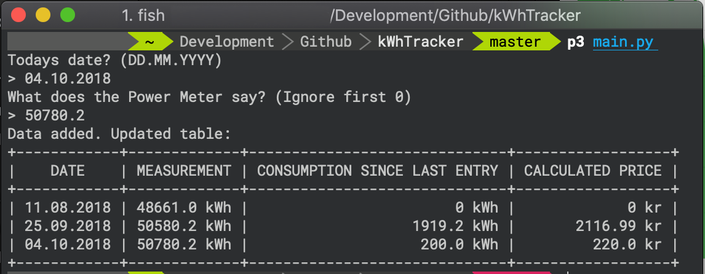

# kWhTracker
## For tracking electricity usage and its costs.




# Dependencies
pipenv for dependencies.
```bash
$ pip3 install pipenv
$ pipenv install
$ DB_USERNAME=... DB_PASSWORD=... pipenv run python3 main.py
```


